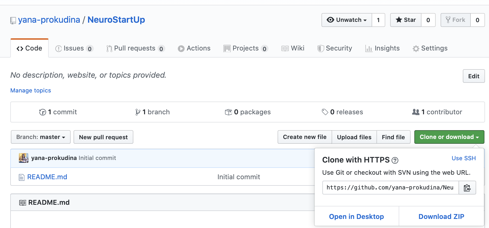

# Git. README.md

GIT is a free and open source distributed version control system designed to handle everything from small to very large projects with speed and efficiency.

### Prerequisites

In order to be able to use GIT you must have:

* Google Chrome, Safari or any available browser (check you use last updated version)
* Terminal for Mac OS / Window / Linux
* Git installation instructions


## Installation and run

Git download files and installation instructions avaliable via [link](https://git-scm.com/downloads)

## Start working

In order to copy this project and run it on your local machine you need to run simple command in terminal:

``` html
git clone <project url>
```
Where **project url** is identificator for the current project which might be find here:



### License terms

Git is open-source and free. No license needed.
In order to ensure you use last updated version it is recommended to check version via following terminal command:

```html
$ git --version
```

In case you need updates use command:

```html
$ brew upgrade git
```